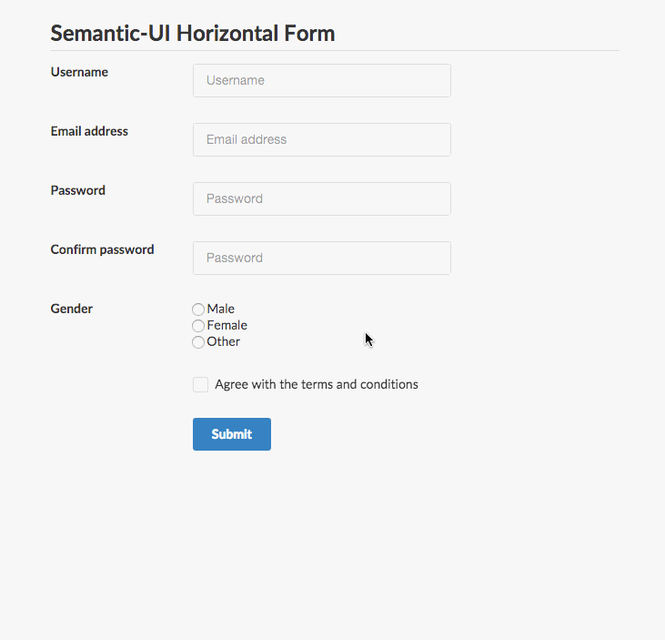

# BootstrapValidator - [v0.5.3](http://bootstrapvalidator.com/download/)

> From next v0.6.0 version, the plugin supports many frameworks (Bootstrap, Foundation, Semantic UI, UIKit).
> It will be renamed to __FormValidation__. The upgrading guide will be available when v0.6.0 is released.

[http://bootstrapvalidator.com](http://bootstrapvalidator.com) - The best [jQuery](http://jquery.com/) plugin to validate form fields, designed to use with [Bootstrap 3](http://getbootstrap.com).

It's developed from scratch by [@nghuuphuoc](http://twitter.com/nghuuphuoc).

__Required__: [jQuery 1.9.1+](http://jquery.com/) and [Bootstrap 3+](http://getbootstrap.com/)

__Validating Bootstrap form__


__Validating Foundation form (v0.6.0)__


__Validating Semantic UI form (v0.6.0)__



__Validating UI Kit form (v0.6.0)__


## Next version :bell:

Next version will be a big release with the following new features and improvements:

- [x] Support many frameworks:
    - [x] [Bootstrap](http://getbootstrap.com/)
    - [x] [Foundation](http://foundation.zurb.com/)
    - [x] [Semantic UI](http://semantic-ui.com/)
    - [x] [UIKit](http://getuikit.com/)
- [x] Support add-ons
- [x] Support multiple languages
- [x] Add ```transformer``` option, allowing to hook the field value before validating
- [x] Allow to reuse data returned by the validator

Follow [@nghuuphuoc](https://twitter.com/nghuuphuoc) and [@formvalidation](https://twitter.com/formvalidation) to be up-to-date.

## Live demo

http://bootstrapvalidator.com/examples/

There are also many examples located in the [demo](demo) directory.

You also can run the ```demo``` locally by:

* Clone the repo: 

```
git clone https://github.com/nghuuphuoc/bootstrapvalidator.git
```

* Go to the cloned directory and run the command: 

```
python -m SimpleHTTPServer 8000
```

* Access the demo at 

```
http://localhost:8000/demo/the_demo_file_here.html
```

## Features

See the [official website](http://bootstrapvalidator.com) for the full list of features

## Download

* Latest version: [v0.5.3](http://bootstrapvalidator.com/download/), released on 2014-11-05
* For older versions, look at the [Releases](https://github.com/nghuuphuoc/bootstrapvalidator/releases) page
* Release History: Look at the [Change Log](CHANGELOG.md)

## Documentation

* [Official website](http://bootstrapvalidator.com)

## Author

The __BootstrapValidator__ plugin is written by Nguyen Huu Phuoc, aka @nghuuphuoc

* [http://twitter.com/nghuuphuoc](http://twitter.com/nghuuphuoc)
* [http://github.com/nghuuphuoc](http://github.com/nghuuphuoc)

## License

BootstrapValidator is free to use in non-commercial projects and applications under the terms of the [Creative Commons BY-NC-ND 3.0](http://creativecommons.org/licenses/by-nc-nd/3.0/) license.

BootstrapValidator may be used in commercial projects and applications with the one-time purchase of a commercial license. 
If you are paid to do your job, and part of your job is implementing BootstrapValidator, a commercial license is required.

For more information about the license, see http://bootstrapvalidator.com/license/